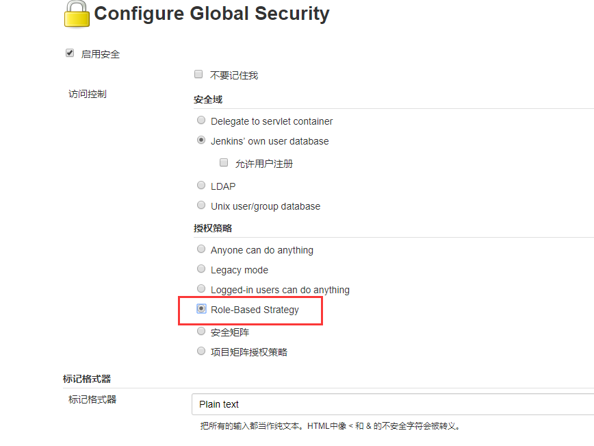
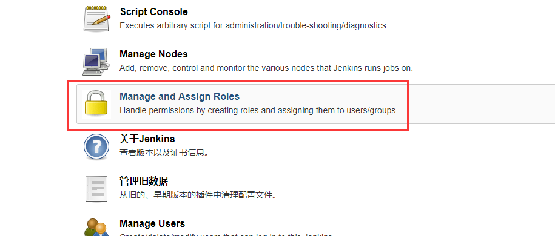
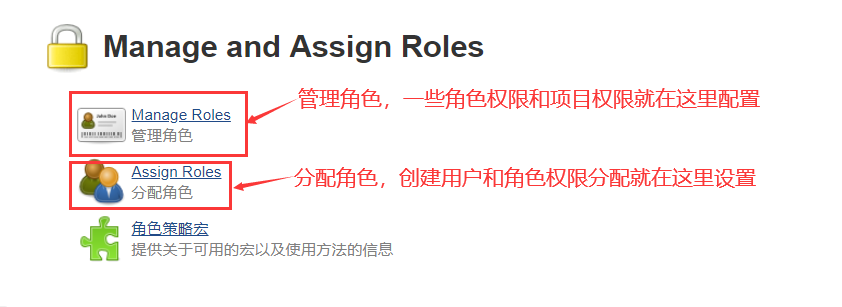
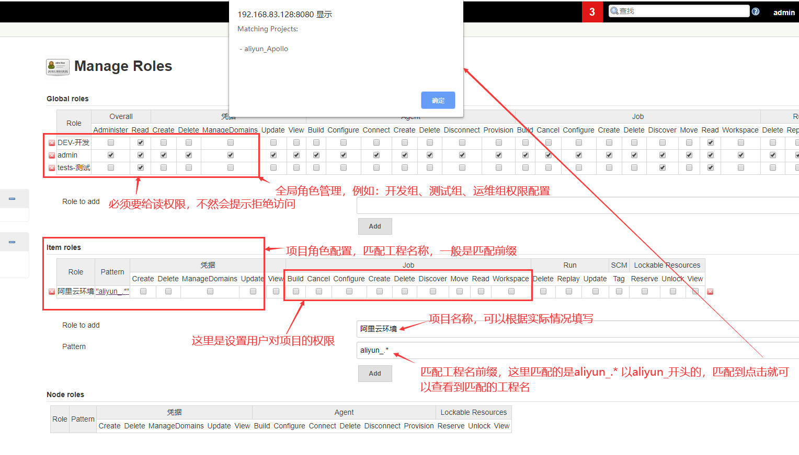
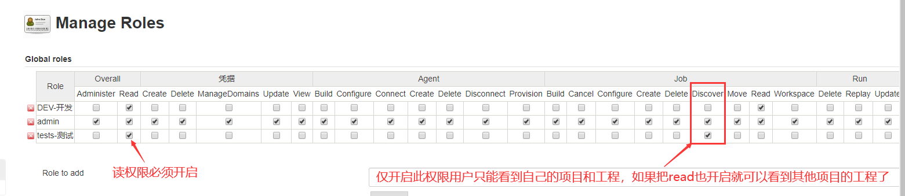
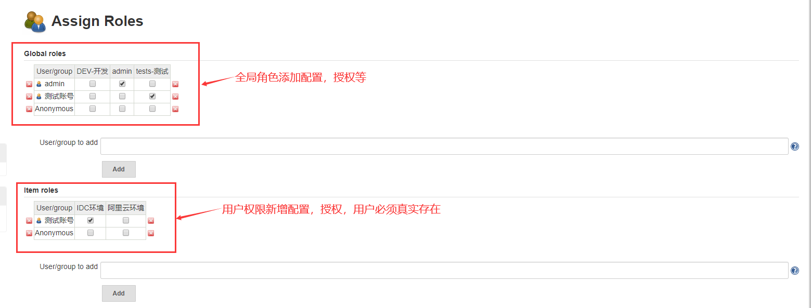

# Jenkins部署和权限管理

### 部署JDK

##### 下载jdk：

```
wget -c https://mirrors.tuna.tsinghua.edu.cn/AdoptOpenJDK/11/jdk/x64/linux/OpenJDK11U-jdk_x64_linux_hotspot_11.0.6_10.tar.gz

tar -xf OpenJDK11U-jdk_x64_linux_hotspot_11.0.6_10.tar.gz 
mv jdk-11.0.6+10 /usr/local/jdk
```

##### 配置环境变量：

```
vim /etc/profile

#java
export JAVA_HOME=/usr/local/jdk/
export CLASSPATH=$CLASSPATH:$JAVA_HOME/lib:$JAVA_HOME/jre/lib
export PATH=$JAVA_HOME/bin:$JAVA_HOME/jre/bin:$PATH:$HOME/bin

#在最底部添加如上代码然后执行：source /etc/profile 即可
```

-------------

### 部署Jenkins：

#####  下载jenkins软件包

```
wget -c https://mirrors.tuna.tsinghua.edu.cn/jenkins/redhat/jenkins-2.190-1.1.noarch.rpm

rpm -ivh jenkins-2.190-1.1.noarch.rpm
```

##### 修改配置文件：

```
vim  /etc/init.d/jenkins
candidates="
/usr/local/jdk/bin/java			#添加jdk的部署路径
/etc/alternatives/java
/usr/lib/jvm/java-1.8.0/bin/java
/usr/lib/jvm/jre-1.8.0/bin/java
/usr/lib/jvm/java-1.7.0/bin/java
/usr/lib/jvm/jre-1.7.0/bin/java
/usr/lib/jvm/java-11.0/bin/java
/usr/lib/jvm/jre-11.0/bin/java
/usr/lib/jvm/java-11-openjdk-amd64
/usr/bin/java
"
```

##### 启动Jenkins：

```
systemctl daemon-reload		
systemctl  start jenkins
```

##### 浏览器访问：http://192.168.83.136:8080

```
rpm安装Jenkins工作目录：/var/lib/jenkins

通过浏览器访问看到：/var/lib/jenkins/secrets/initialAdminPassword
```

根据提示完成密码设置

```
查看密码：
cat /var/lib/jenkins/secrets/initialAdminPassword
```

根据提示完成配置即可；

#### 由于默认插件源在国外服务器，大多数网络无法顺利下载，需修改国内插件源地址：

##### 解决方法：

```
1、进入jenkins的工作目录：
cd /var/lib/jenkins/updates

2、执行如下代码，将default.jason文件里面的地址替换为国内清华源，检测google的地址替换为baidu,com
sed -i 's/http:\/\/updates.jenkins-ci.org\/download/https:\/\/mirrors.tuna.tsinghua.edu.cn\/jenkins/g' default.json && \
sed -i 's/http:\/\/www.google.com/https:\/\/www.baidu.com/g' default.json

3、重启jenkins即可
```

------------------------

### 配置maven：

##### 下载maven包：

wget -chttp://mirrors.hust.edu.cn/apache/maven/maven-3/3.6.3/binaries/apache-maven-3.6.3-bin.tar.gz

```
tar -xf apache-maven-3.6.3-bin.tar.gz

mv apache-maven-3.6.3 /usr/local/maven
```

##### 配置环境变量：

```
在/etc/profile文件中添加如下：
export PATH=$PATH:/usr/local/maven/bin
```

执行：source  /etc/profile

##### 测试：

```
[root@localhost ~]# mvn -version
Apache Maven 3.6.3 (cecedd343002696d0abb50b32b541b8a6ba2883f)
Maven home: /usr/local/maven
Java version: 1.8.0_181, vendor: Oracle Corporation, runtime: /usr/local/jdk/jre
Default locale: en_US, platform encoding: UTF-8
OS name: "linux", version: "3.10.0-693.el7.x86_64", arch: "amd64", family: "unix"
```

--------------------

#### Jenkins配置JDK和maven

```
Jenkins首页-->系统管理--->全局工具配置--->JDK/Maven进行配置即可
```

安装maven插件：Maven Integration

Jenkins首页-->系统管理--->插件管理找到：Maven Integration安装即可

其他插件安装的方式也是一样。

------------

### jenkins安装Role-based Authorization Strategy插件

Role Strategy Plugin插件可以对构建的项目进行授权管理，让不同的用户管理不同的项目，将测试和生产环境分开。

具体配置方法如下：

```
Jenkins首页-->系统管理--->插件管理找到：Role-based Authorization Strategy安装即可
```

启动插件：



启用后在管理jenkins页面中就可以看到如下：






#### 管理角色：





#### 分配角色：



参考：https://blog.whsir.com/post-1785.html

