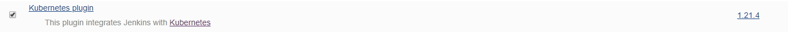
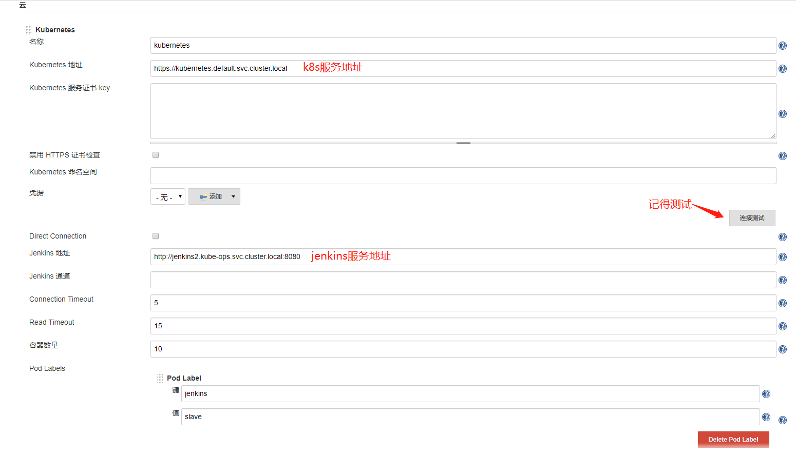
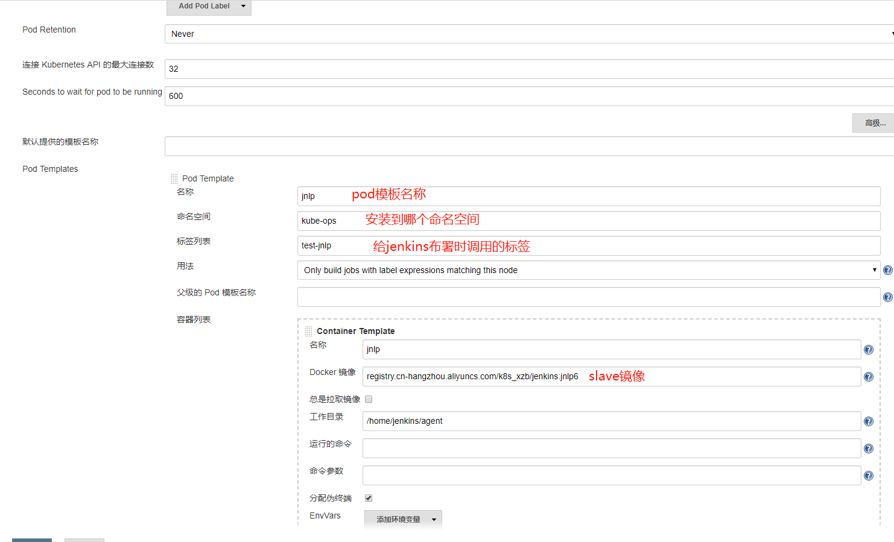
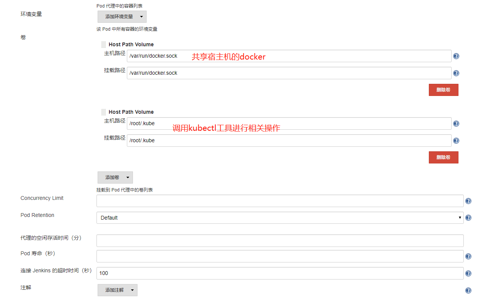
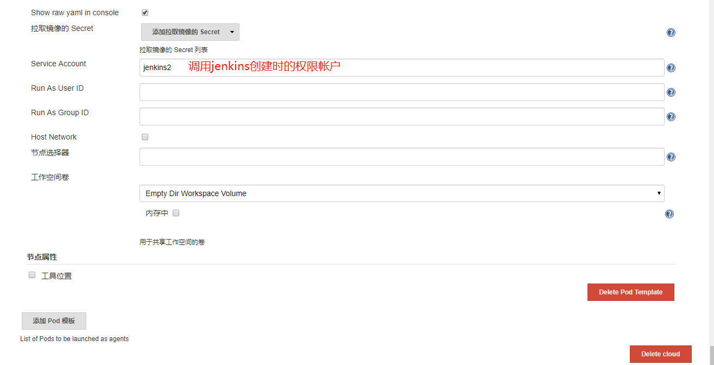
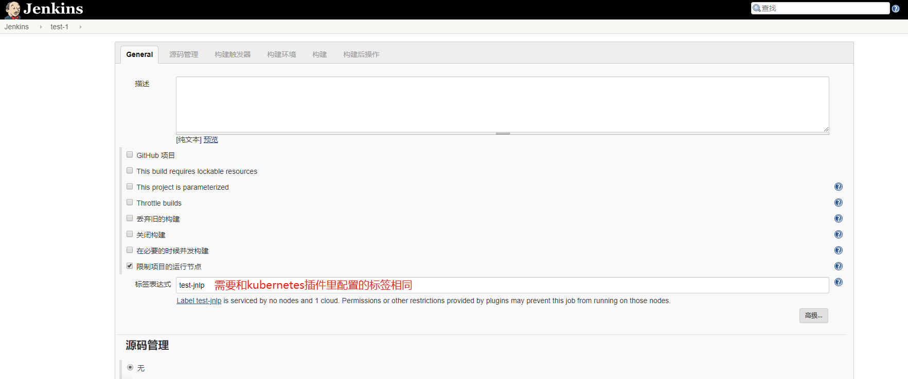
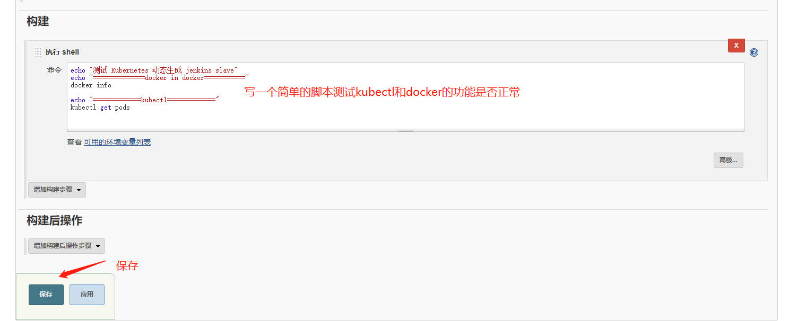
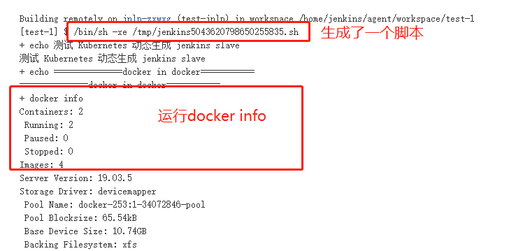
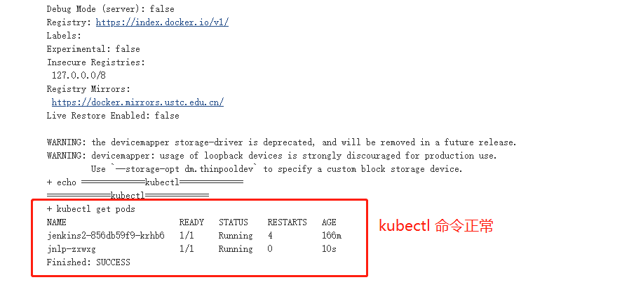

#### 1. 安装kubernetes插件
> 插件中心搜索kubernetes插件安装即可

#### 2. 配置kubernetes插件和slave镜像模板
- 点击 Manage Jenkins —> Configure System —> (拖到最下方)新增云 —> 选择 Kubernetes，然后填写 Kubernetes 和 Jenkins 配置信息

#### 3. 测试kubernetes和slave等功能

> 到主页布署这个任务,查看输出日志

#### 4. 查看slave发布完成后是否自动退出
