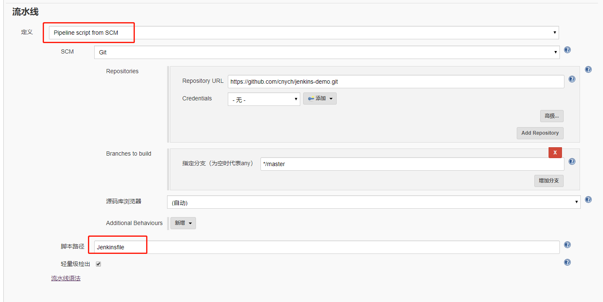

#### 1. Scripted Pipeline(脚本式)语法 简单示例

- 编写代码
- 测试
- 编写 Dockerfile
- 构建打包 Docker 镜像
- 推送 Docker 镜像到仓库
- 编写 Kubernetes YAML 文件
- 更改 YAML 文件中 Docker 镜像 TAG
- 利用 kubectl 工具部署应用

```Groovy
// node为运行环境 ,这里表示运行到我们定义的test-jnlp的slave
node('test-jnlp') {
    // stage 表示阶段,这里表示准备阶段,Prepare可以自定义名字
    stage('Prepare') {
        // 输出文本
        echo "1.Prepare Stage"
        // git url 固定写法,表示克隆git仓库,仓库里包含k8s,yaml,jenkinsfile,Dockerfile等文件.下面的步骤将会用到
        git url: "https://github.com/cnych/jenkins-demo.git"
        script {
            // 运行sh命令git rev-parse --short HEAD,取得git的tag,trim移除空格,returnStdout输出结果
            build_tag = sh(returnStdout: true, script: 'git rev-parse --short HEAD').trim()
            echo "build_tag ========== $build_tag"
            // 如果环境变量BRANCH_NAME不等于master则更改一下tag
            if (env.BRANCH_NAME != 'master') {
                build_tag = "${env.BRANCH_NAME}-${build_tag}"
                echo "testestestetst =========  $build_tag"
            }
        }
    }
    stage('Test') {
        // 测试阶段
      echo "2.Test Stage"
    }
    stage('Build') {
        // 打包容器,注:dockerfile文件必须在当前目录.
        echo "3.Build Docker Image Stage"
        sh "docker build -t registry.cn-hangzhou.aliyuncs.com/k8s_xzb/jenkins-demo:${build_tag} ."
    }
    stage('Push') {
        // 推送容器到仓库
        echo "4.Push Docker Image Stage"
        // 这里的密码从jenkins的全局参数里获取,获取前必须定义好
        withCredentials([usernamePassword(credentialsId: 'dockerHub', passwordVariable: 'dockerHubPassword', usernameVariable: 'dockerHubUser')]) {
            // 登陆仓库
            sh "docker login -u ${dockerHubUser} -p ${dockerHubPassword} registry.cn-hangzhou.aliyuncs.com"
            // 推送到仓库
            sh "docker push registry.cn-hangzhou.aliyuncs.com/k8s_xzb/jenkins-demo:${build_tag}"
        }
    }
    stage('Deploy') {
        // 布署阶段
        echo "5. Deploy Stage"
        // 判断是否为master版本,人工干预
        if (env.BRANCH_NAME == 'master') {
            input "确认要部署线上环境吗？"
        }
        // 替换yaml文件里的值,比如镜像地址,版本等
        sh "sed -i 's/<BUILD_TAG>/${build_tag}/' k8s.yaml"
        sh "sed -i 's/<BRANCH_NAME>/${env.BRANCH_NAME}/' k8s.yaml"
        sh "sed -i 's#cnych/jenkins-demo#registry.cn-hangzhou.aliyuncs.com/k8s_xzb/jenkins-demo#' k8s.yaml"
        // 利用kubectl 布署
        sh "kubectl apply -f k8s.yaml --record"
    }
}

```


#### 2. 声明式语法 简单示例
- 首先需要在jenkins的全局中定义好你的git,harbor等脚本中需要用到的帐号密码和变量等

- 流水线模块选择scm语法

- jenkinsfile脚本内容,放到git仓库做版本控制
```Groovy
node('haimaxy-jnlp') {
    stage('Prepare') {
        echo "1.Prepare Stage"
        // 仓库克隆这里定义为scm,其它基本一样
        checkout scm
        script {
            build_tag = sh(returnStdout: true, script: 'git rev-parse --short HEAD').trim()
            if (env.BRANCH_NAME != 'master') {
                build_tag = "${env.BRANCH_NAME}-${build_tag}"
            }
        }
    }
    stage('Test') {
      echo "2.Test Stage"
    }
    stage('Build') {
        echo "3.Build Docker Image Stage"
        sh "docker build -t cnych/jenkins-demo:${build_tag} ."
    }
    stage('Push') {
        echo "4.Push Docker Image Stage"
        withCredentials([usernamePassword(credentialsId: 'dockerHub', passwordVariable: 'dockerHubPassword', usernameVariable: 'dockerHubUser')]) {
            sh "docker login -u ${dockerHubUser} -p ${dockerHubPassword}"
            sh "docker push cnych/jenkins-demo:${build_tag}"
        }
    }
    stage('Deploy') {
        echo "5. Deploy Stage"
        if (env.BRANCH_NAME == 'master') {
            input "确认要部署线上环境吗？"
        }
        sh "sed -i 's/<BUILD_TAG>/${build_tag}/' k8s.yaml"
        sh "sed -i 's/<BRANCH_NAME>/${env.BRANCH_NAME}/' k8s.yaml"
        sh "kubectl apply -f k8s.yaml --record"
    }
}
```