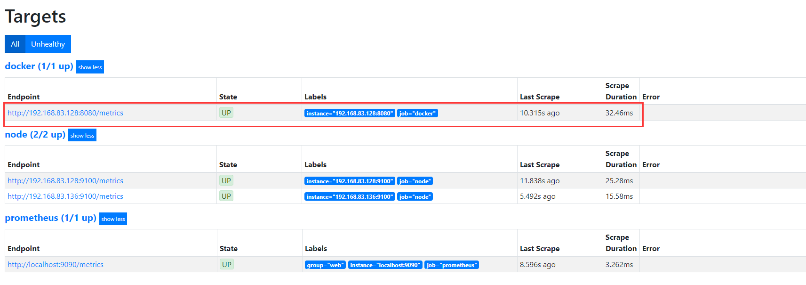
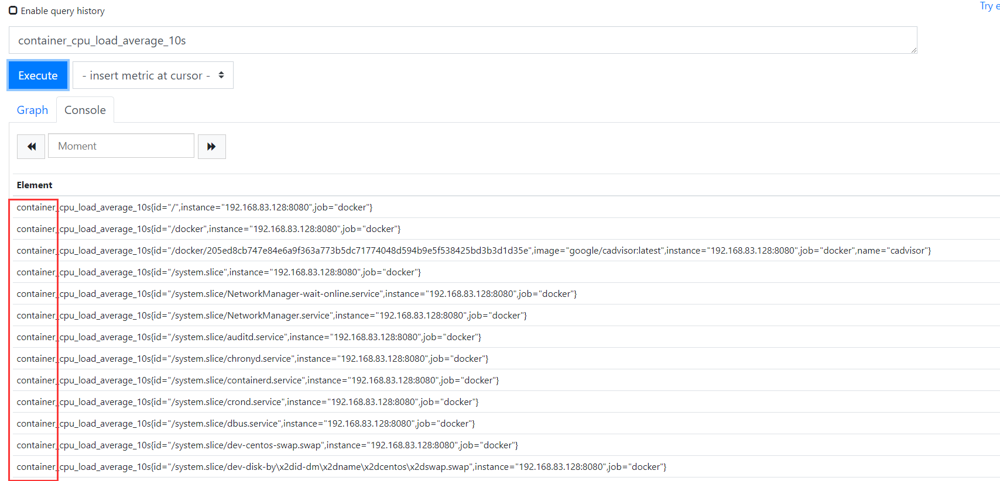
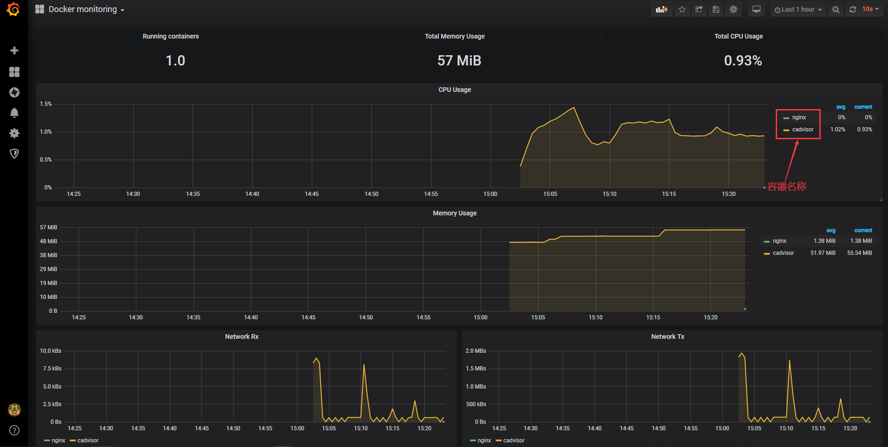

# Prometheus监控docker

Prometheus监控docker需要安装：cadvisor插件

可以先将镜像拉取下来：

```
docker pull google/cadvisor:latest
```

启动cadvisor:

```
docker run   --volume=/:/rootfs:ro   --volume=/var/run:/var/run:ro --volume=/sys:/sys:ro  --volume=/var/lib/docker/:/var/lib/docker:ro --volume=/dev/disk/:/dev/disk:ro --publish=8080:8080 --detach=true --name=cadvisor google/cadvisor:latest

```

浏览器访问：http://192.168.83.128:8080/即可看到cadvisor收集容器的相关信息指标

-------------

将cadvisor加入到Prometheus监控

编辑Prometheus配置文件添加如下代码：

```
vim  prometheus.yml
- job_name: 'docker'
  static_configs:
  - targets: ['192.168.83.128:8080']
```

编辑完配置文件执行：kill -hup  1910   重新加载一下配置文件：1910是Prometheus的PID




因为之前配置了node_exporter监控了docker服务所以这里就胡显示出来

接下来查看一下docker的监控数据



如上图：以container开头的是docker的采集数据

---------------

在grafana中导入一个监控docker的图表：

```
https://grafana.com/dashboards/193   #图表编号是193
```

这个监控的指标主要是：容器cpu利用率、内存利用率、网卡、流量等监控；注意是docker容器的资源利用率

这里监控的有两个容器：cadvisor和nginx    后面新启的容器也会自动加入进来！

-------------------------

