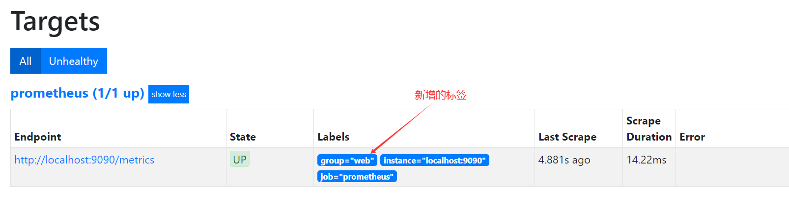
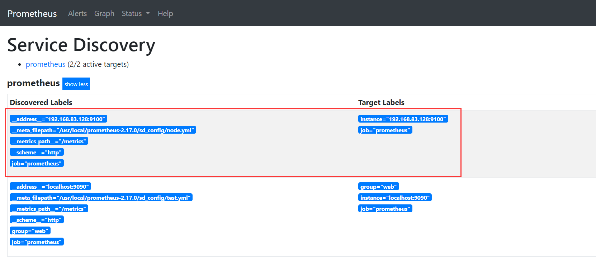
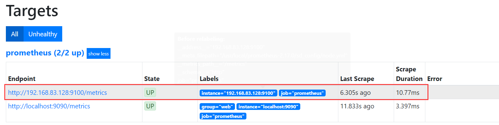
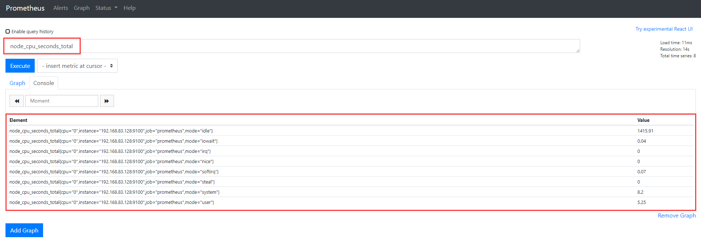
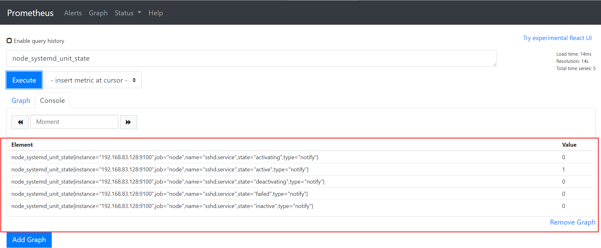

# Prometheus监控

### Prometheus特点：

```
1、多维数据模型：由度量名称和键值对标识的时间序列数据

2、PromSQL：一种灵活的查询语言，可以利用多维数据完成复杂的查询

3、不依赖分布式存储，单个服务器节点可直接工作

4、基于HTTP的pull方式采集时间序列数据

5、推送时间序列数据通过PushGateway组件支持

6、通过服务发现或静态配置发现目标

7、多种图形模式及仪表盘支持（grafana）
```

##### 监控项目：

| 监控类型 | 监控项目                                                     |
| -------- | ------------------------------------------------------------ |
| 硬件监控 | 温度、硬件故障的                                             |
| 系统监控 | CPU、内存、硬盘、网卡流量、TCP状态、进程数                   |
| 应用监控 | nginx、Tomcat、PHP、mysql、redis等                           |
| 日志监控 | 系统日志、服务日志、访问日志、错误日志                       |
| 安全监控 | WAF、敏感文件监控                                            |
| API监控  | 可用性、接口请求、响应时间                                   |
| 业务监控 | 如电商网站、每分钟生产多少订单、注册多少用户、多少活跃用户、推广活动效果 |
| 流量分析 | 根据流量获取用户相关信息、例如用户地理位置、某页面访问状况、页面停留时间等 |

### Prometheus 组成及架构

```
Prometheus Server：收集指标和存储时间序列数据，并提供查询接口

ClientLibrary：客户端库

Push Gateway：短期存储指标数据。主要用于临时性的任务

Exporters：采集已有的第三方服务监控指标并暴露metrics

Alertmanager：告警

Web UI：简单的Web控制台
```

### 指标类型

```
Counter：递增的计数器

Gauge：可以任意变化的数值

Histogram：对一段时间范围内数据进行采样，并对所有数值求和与统计数量

Summary：与Histogram类似
```

---------

### Prometheus部署：

Prometheus官网地址：https://prometheus.io/

官方文档：https://prometheus.io/docs/introduction/overview/

下载Prometheus软件包：

```
wget https://github.com/prometheus/prometheus/releases/download/v2.17.0-rc.3/prometheus-2.17.0-rc.3.linux-amd64.tar.gz
```

由于是二进制包解压就可以使用

```
tar -xf prometheus-2.17.0-rc.3.linux-amd64.tar.gz
mv /usr/local/prometheus-2.17.0

```

##### 启动Prometheus：

```
cd /usr/local/prometheus-2.17.0
./prometheus --config.file="prometheus.yml"
-----------------------------------------------
#prometheus.yml		Prometheus的配置文件，启动时需要带配置文件启动

#Prometheus默认端口：9090

配置Prometheus监控本身
scrape_configs:
  -job_name: 'prometheus'
   scrape_interval: 5s
   static_configs:
     -targets: ['localhost:9090']
```

浏览器访问：http://192.168.83.136:9090

```
alerts	告警管理，监控告警的规则

graph	图形，可以使用promql 查询数据

status	查看基础环境的一些状态，命令行的日志，当前Prometheus的配置
```


-------------

#### Prometheus配置系统管理启动：systemd启动

```
vim /usr/lib/systemd/system/prometheus.service
[Unit]
Description=prometheus.io

[Service]
Restart=on-failure
ExecStart=/usr/local/prometheus-2.17.0/prometheus --config.file=/usr/local/prometheus-2.17.0/prometheus.yml

[Install]
WantedBy=multi-user.target
```

加载一下配置文件并启动Prometheus：

```
systemctl daemon-reload

systemctl  start prometheus
```

-------------------

#### docker部署Prometheus

```
docker pull prom/prometheus
```

##### 启动Prometheus：

```
docker run -itd -p 9090:9090 --name prometheus -v /usr/local/prometheus-2.17.0/prometheus.yml:/etc/prometheus/prometheus.yml prom/prometheus:latest
```

---------------

### prometheus全局配置文件：

```
# 全局配置
global:

  # 默认抓取周期，可用单位ms、smhdwy #设置每15s采集数据一次，默认1分钟
  [ scrape_interval: <duration> | default = 1m ]

  # 默认抓取超时
  [ scrape_timeout: <duration> | default = 10s ]

  # 估算规则的默认周期 # 每15秒计算一次规则。默认1分钟
  [ evaluation_interval: <duration> | default = 1m ]

  # 和外部系统（例如AlertManager）通信时为时间序列或者警情（Alert）强制添加的标签列表
  external_labels:
    [ <labelname>: <labelvalue> ... ]
 
# 告警规则文件列表
rule_files:
  [ - <filepath_glob> ... ]	如：- targets: ['localhost:9090']
 
# 抓取配置列表监控指标，配置目标监控主机，
scrape_configs:
  [ - <scrape_config> ... ]
 
# Alertmanager相关配置，配置告警部分
alerting:
  alert_relabel_configs:
    [ - <relabel_config> ... ]
  alertmanagers:
    [ - <alertmanager_config> ... ]
 
# 远程读写特性相关的配置
remote_write:
  [ - <remote_write> ... ]
remote_read:
  [ - <remote_read> ... ]
```

#### scrape_config配置选项

```
# 默认分配给已抓取指标的job名称。
job_name: <job_name>

# 从job中抓取目标的频率.
[ scrape_interval: <duration> | default = <global_config.scrape_interval> ]

# 抓取此job时，每次抓取超时时间.
[ scrape_timeout: <duration> | default = <global_config.scrape_timeout> ]

# 从目标获取指标的HTTP资源路径.
[ metrics_path: <path> | default = /metrics ]

# honor_labels控制Prometheus如何处理已经存在于已抓取数据中的标签与Prometheus将附加服务器端的标签之间的冲突（"job"和"instance"标签，手动配置的目标标签以及服务发现实现生成的标签）。
# 
# 如果honor_labels设置为"true"，则通过保留已抓取数据的标签值并忽略冲突的服务器端标签来解决标签冲突。
#
# 如果honor_labels设置为"false"，则通过将已抓取数据中的冲突标签重命名为"exported_ <original-label>"（例如"exported_instance"，"exported_job"）然后附加服务器端标签来解决标签冲突。 这对于联合等用例很有用，其中应保留目标中指定的所有标签。
# 
# 请注意，任何全局配置的"external_labels"都不受此设置的影响。 在与外部系统通信时，它们始终仅在时间序列尚未具有给定标签时应用，否则将被忽略。
# 
[ honor_labels: <boolean> | default = false ]		#默认false不覆盖，true为覆盖

----------------------------------------------------------------------------------------
# 配置用于请求的协议方案.
[ scheme: <scheme> | default = http ]

# 可选的HTTP URL参数.
params:
  [ <string>: [<string>, ...] ]

# 使用配置的用户名和密码在每个scrape请求上设置`Authorization`标头。 password和password_file是互斥的。
basic_auth:
  [ username: <string> ]
  [ password: <secret> ]
  [ password_file: <string> ]

# 使用配置的承载令牌在每个scrape请求上设置`Authorization`标头。 它`bearer_token_file`和是互斥的。
[ bearer_token: <secret> ]

# 使用配置的承载令牌在每个scrape请求上设置`Authorization`标头。 它`bearer_token`和是互斥的。
[ bearer_token_file: /path/to/bearer/token/file ]

# 配置scrape请求的TLS设置.
tls_config:
  [ <tls_config> ]

# 可选的代理URL.
[ proxy_url: <string> ]

# Azure服务发现配置列表.
azure_sd_configs:
  [ - <azure_sd_config> ... ]

--------------------------------------------------------------------------------------
# Consul服务发现配置列表.
consul_sd_configs:
  [ - <consul_sd_config> ... ]

# DNS服务发现配置列表。
dns_sd_configs:
  [ - <dns_sd_config> ... ]

# EC2服务发现配置列表。
ec2_sd_configs:
  [ - <ec2_sd_config> ... ]

# OpenStack服务发现配置列表。
openstack_sd_configs:
  [ - <openstack_sd_config> ... ]

# 文件服务发现配置列表。
file_sd_configs:
  [ - <file_sd_config> ... ]

# GCE服务发现配置列表。
gce_sd_configs:
  [ - <gce_sd_config> ... ]

# Kubernetes服务发现配置列表。
kubernetes_sd_configs:
  [ - <kubernetes_sd_config> ... ]

# Marathon服务发现配置列表。
marathon_sd_configs:
  [ - <marathon_sd_config> ... ]

# AirBnB的神经服务发现配置列表。
nerve_sd_configs:
  [ - <nerve_sd_config> ... ]

# Zookeeper Serverset服务发现配置列表。
serverset_sd_configs:
  [ - <serverset_sd_config> ... ]

# Triton服务发现配置列表。
triton_sd_configs:
  [ - <triton_sd_config> ... ]

-----------------------------------------------------------------------------------

# 此job的标记静态配置目标列表。
static_configs:
  [ - <static_config> ... ]

# 目标重新标记配置列表，允许在采集之前对任何目标及其标签进行修改
relabel_configs:				#在数据采集之前对标签重新标记或者命名，
  [ - <relabel_config> ... ]	重新标签的意义？
								重命名标签名
								删除标签
								过滤目标		

# 度量标准重新配置列表。
metric_relabel_configs:			
  [ - <relabel_config> ... ]

# 对每个将被接受的样本数量的每次抓取限制。
# 如果在度量重新标记后存在超过此数量的样本，则整个抓取将被视为失败。 0表示没有限制。
[ sample_limit: <int> | default = 0 ]
```

#### relabel_config

重命名标签名、删除标签、过滤目标

```
relabed_config
#源标签,标签名通过逗号，分隔
[ source_labels: '[' <labelname> [, ...] ']' ]
#多个源标签时连接的分割符，标签值通过分号做分割符
[ separator: <string> | default = ; ]
#重新标记的标签
[ target_label: <labelname> ]
#正则表达式匹配源标签的值
[ regex: <regex> | default = (.*) ]


[ modulus: <uint64> ]

#替换正则表达式匹配到的分组，分组引用 $1,$2,$3,...
[ replacement: <string> | default = $1 ]

#基于正则表达式匹配执行的操作
[ action: <relabel_action> | default = replace ]
---------------------------------------------------
示例如下：
 static_configs:
    - targets: ['localhost:9090']	
      labels:		#给上面的targets添加一个标签：idc: gz
        idc: gz		#标签key值
        
---------------------------------------------------
---------------------------------------------------
action：重新标签动作
replace：默认，通过regex匹配source_label的值，使用replacement来引用表达式匹配的分组
keep：删除regex与连接不匹配的目标source_labels
drop：删除regex与连接匹配的目标source_labels
labeldrop：删除regex匹配的标签
labelkeep：删除regex不匹配的标签
hashmod：设置target_label为modulus连接的哈希值source_labels
labelmap：匹配regex所有标签名称。然后复制匹配标签的值进行分组，replacement分组引用（${1},${2},…）替代

```

-------------

### 基于文件的服务发现功能：

##### file_sd_configs

在Prometheus.yml配置文件中指定file_sd_config文件位置

```
vim prometheus.yml
 #static_configs:		注释这个静态发现的配置
 #   - targets: ['localhost:9090']
 添加如下配置：
  file_sd_configs:	#于job同级
    - files: ['/usr/local/prometheus-2.17.0/sd_config/test.yml']	#指定服务发现的文件路径
      refresh_interval: 5s	  #动态加载，指定刷新间隔，5秒读取一次配置文件；
-------------------------------------------------------------------------------------
创建目录和文件：
mkdir -p /usr/local/prometheus-2.17.0/sd_config
cd /usr/local/prometheus-2.17.0/sd_config
vim test.yml
- targets: ['localhost:9090']
  labels:			#新增标签
    group: web		#标签key值
```




-------------------

## node监控：

监控Linux服务器的资源、服务

在node节点启动一个agent名叫node_exporter

```
wget https://github.com/prometheus/node_exporter/releases/download/v1.0.0-rc.0/node_exporter-1.0.0-rc.0.linux-amd64.tar.gz

tar -xf node_exporter-1.0.0-rc.0.linux-amd64.tar.gz
mv node_exporter-1.0.0-rc.0.linux-amd64.tar.gz node_exporter
```

##### 加入systemd启动：

```
vim /usr/lib/systemd/system/node_exporter.service
[Unit]
Description=prometheus.io

[Service]
Restart=on-failure
ExecStart=/usr/local/node_exporter/node_exporter

[Install]
WantedBy=multi-user.target
```

systemctl  daemon-reload

启动：systemctl start node_exporter.service

默认会监听：9100端口

在Prometheus服务器的主配置文件中增加一个job

```
vim /usr/local/prometheus-2.17.0/prometheus.yml  增加如下配置
- job_name: 'node'		#新增一个job
  file_sd_configs:		#于job同级
    - files: ['/usr/local/prometheus-2.17.0/sd_config/node.yml']
      refresh_interval: 5s	 
-------------------------------------------------------------------
在sd_config目录中新增配置文件：
vim node.yml
- targets: 
  - 192.168.83.128:9100
```

保存配置文件退出后重新加载一下prometheus.ym主配文件





node端的监控数据指标查看：http://192.168.83.128:9100/metrics

在web端查看一下node的监控信息如：cpu



-----------------

编写sql查看资源利用率等：

```
#查看node的CPU在5分钟内的使用率：
#先统计CPU的空闲值，总CPU减去空闲值就等于使用率了；
100-(avg(irate(node_cpu_seconds_total{mode="idle"}[5m]))by(instance)*100)
#查看CPU空闲率：
avg(irate(node_cpu_seconds_total{mode="idle"}[5m]))by(instance)*100
#*100	表示使用百分比查看
--------------------------------------------------------------------------------------
#查看node的内存使用率：
#公式：100-（剩余内存+buff/cache）除以总内存 *100
100-(node_memory_MemFree_bytes+node_memory_Cached_bytes+node_memory_Buffers_bytes)/node_memory_MemTotal_bytes*100
查看内存空闲率则是：
(node_memory_MemFree_bytes+node_memory_Cached_bytes+node_memory_Buffers_bytes)/node_memory_MemTotal_bytes*100
#*100	表示使用百分比查看
--------------------------------------------------------------------------------------
#查看node的磁盘使用率：
剩余的值除以总大小计算出剩余的百分比
100-(node_filesystem_free_bytes{mountpoint="/",fstype=~"ext4|xfs"}/node_filesystem_size_bytes{mountpoint="/",fstype=~"ext4|xfs"}*100)

#mountpoint="/"  		查看根目录下的
fstype=~"ext4|xfs"  	过滤只查看ext4|xfs格式的分区
#*100	表示使用百分比查看
查看磁盘空闲率则是：
node_filesystem_free_bytes{mountpoint="/",fstype=~"ext4|xfs"}/node_filesystem_size_bytes{mountpoint="/",fstype=~"ext4|xfs"}*100
```

-------------

### 监控服务运行状态：

在node_exporter服务systemd启动服务配置文件中加入如下选项即可：

```
#打开配置文件在启动文件后面添加参数即可：
ExecStart=/usr/local/node_exporter/node_exporter --collector.systemd --collector.systemd.unit-whitelist=(docker|sshd|nginx).service

#只监控(docker|sshd|nginx)这几个服务，可以根据需求来定；
重启node_exporter
systemctl daemon reload
systemctl restart node_exporter

查看进程：看到有启动了刚配置的参数说明成功！
root@localhost node_exporter]# ps -ef|grep node_exporter
root       7416      1  0 19:33 ?        00:00:00 /usr/local/node_exporter/node_exporter --collector.systemd --collector.systemd.unit-whitelist=(docker|sshd|nginx).service
root       7421   7300  0 19:35 pts/0    00:00:00 grep --color=auto node_exporter

#可以使用启动文件的help来查看相关参数说明
```

去web页面查看一下监控的服务：



由于我的node没有装docker和nginx，所以只看到sshd.service的服务

也可以使用sql语句来查询：

```
node_systemd_unit_state{instance="192.168.83.128:9100",job="node",name="sshd.service"}
node_systemd_unit_state{instance="192.168.83.128:9100",job="node",name="nginx.service"}
node_systemd_unit_state{instance="192.168.83.128:9100",job="node",name="docker.service"}
#有0和1两种状态，1是active活动状态，0是关闭状态
```

prometheus支持配置热加载

```
kill -hup 47746			#执行kill -hup pid  配置文件就热加载了； 
```

配置文件语法检测：./promtool check config ./prometheus.yml

官方说明：https://prometheus.io/docs/prometheus/latest/configuration/configuration/

