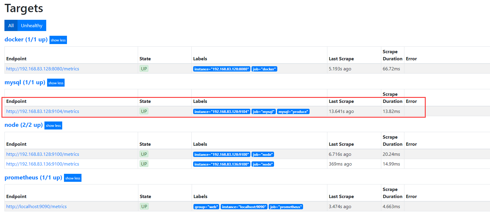
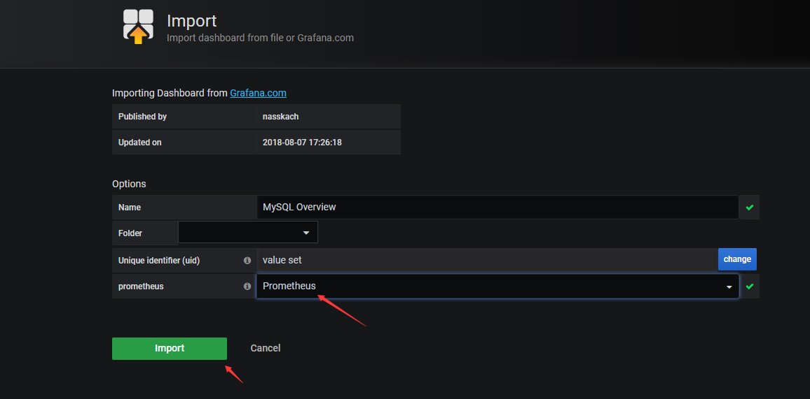
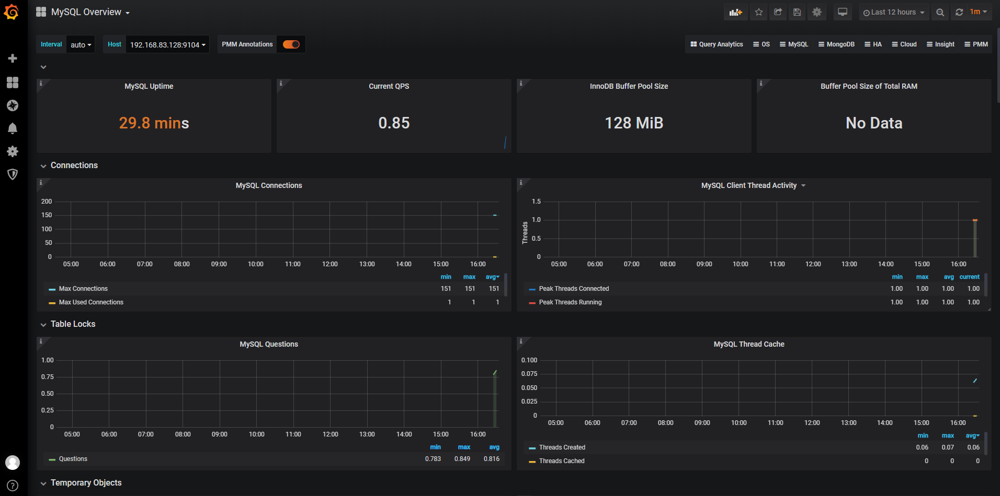

# 监控mysql服务器

监控mysql服务器需要安装：mysqld_exporter

mysqld_exporter官方说明：https://github.com/prometheus/mysqld_exporter

```
wget https://github.com/prometheus/mysqld_exporter/releases/download/v0.12.1/mysqld_exporter-0.12.1.linux-amd64.tar.gz
-----------------------
tar -xf mysqld_exporter-0.12.1.linux-amd64.tar.gz
mv mysqld_exporter-0.12.1.linux-amd64.tar.gz /usr/local/mysqld_exporter
```

在mysql中创建一个用户并授权给Prometheus监控

```
CREATE USER 'exporter'@'localhost' IDENTIFIED BY '123456' WITH MAX_USER_CONNECTIONS 3;
GRANT PROCESS, REPLICATION CLIENT, SELECT ON *.* TO 'exporter'@'localhost';
----------------------------
#WITH MAX_USER_CONNECTIONS 3  最大连接数，由于这里使用mariadb所以不支持，可去掉
--------------
授权：
PROCESS			#查看当前运行的线程情况 
REPLICATION		#查看主从连接状态
```

启动mysqld_exporter

```
/usr/local/mysqld_exporter/mysqld_exporter --config.my-cnf=/usr/local/mysqld_exporter/my.cnf
#mysqld_exporter监听的端口是9104
```

加入systemd启动

```
[root@localhost system]# vim mysqld_exporter.service 
[Unit]
Description=mysqld_exporter

[Service]
Restart=on-failure
ExecStart=/usr/local/mysqld_exporter/mysqld_exporter --config.my-cnf=/usr/local/mysqld_exporter/my.cnf


[Install]
WantedBy=multi-user.target

```

浏览器访问：http://192.168.83.128:9104/metrics  即可看到监控上报的数据


在Prometheus配置文件中新增一个job：

```
vim prometheus.yml
- job_name: 'mysql'
    static_configs:
    - targets: ['192.168.83.128:9104']
      labels:				#新增一个标签，可以不加
        mysql: produce		#标签key值

```

kill -hup 1910



加入grafana展示

导入图表模板：https://grafana.com/dashboards/7362





